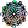

#  Point Based Physics 2D 

This is a little experiment I did a while ago, a point-based physics sandbox.  
I've since brushed it off and added **audio!** which is fun!

You can [check it out here](https://1j01.github.io/pbp2d).

## Ways to Lose Data

There's **no save/load**.

Some things are not in the undo state, even tho they affect the world:
- browser window size,
- in-app window positions and sizes,
- simulation options like gravity

Furthermore, if the simulation is active, undoing and redoing is destructive,
because the states will be replaced with ones further ahead in time,
as you traverse the stacks / go back and forth.

And some things don't create undo history, like dragging points, and connecting points, currently,
so you can go for quite some time messing around without creating any undo states you can go back to.

## Help + TODO

See in-app Help and TODO windows accessible from the Options window.

## License

[WTFPL](https://en.wikipedia.org/wiki/WTFPL) or [CC0](https://creativecommons.org/publicdomain/zero/1.0/)

## Contributing

This is just a toy, so I'm happy growing it as organically as the structures you can create with it.

Feel free to send pull requests adding weird tools.

## See Also

* [Skele2D][], a newer project of mine, a point-based editor / game engine thing

* [verlet-js][], a point based physics engine that can have more solid shapes (bodies) because it uses [Verlet integration][]

[Skele2D]: https://github.com/1j01/skele2d
[verlet-js]: https://github.com/subprotocol/verlet-js
[Verlet integration]: https://en.wikipedia.org/wiki/Verlet_integration
